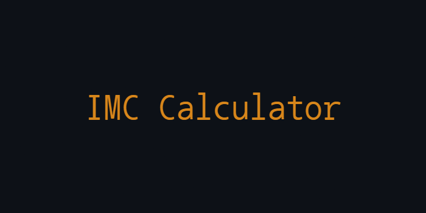
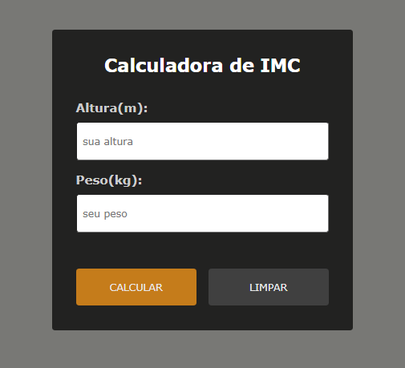

  

## Overview

- This is a simple web application that allows users to input their height and weight to calculate their Body Mass Index (BMI)

  

## Installation and Usage

To view the tribute page locally, follow these steps:

1. Download this repository
2. Open the index.html file in your preferred web browser

## License

This project is licensed under the MIT License. See the [LICENSE](LICENSE) file for details.
